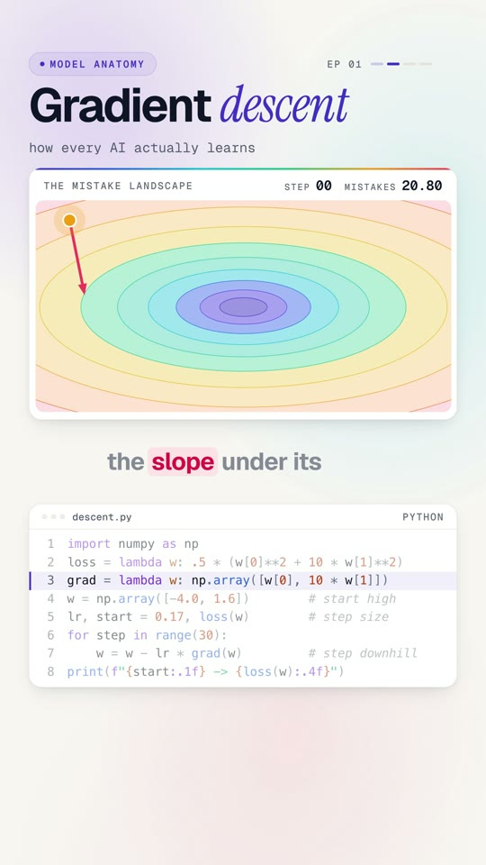

# 01 · Gradient descent



**Every AI learns by walking downhill.** Picture the model standing on a hill, blindfolded. The height of the hill
is how wrong it is. It can't see the bottom, so it feels the slope under its feet and takes a small step down.
Thirty steps later, the mistake goes from 20.8 to almost zero.

Watch: [YouTube](https://www.youtube.com/@datanatomyai) · [TikTok](https://www.tiktok.com/@datanatomy.ai) · [Instagram](https://www.instagram.com/datanatomy.ai) (32 seconds)

<br clear="right">

## The idea

A model has some numbers (weights) and a *loss*: one number that says how wrong the model is. Gradient descent
improves the weights with one rule, repeated:

```
w ← w − η · ∇L(w)
```

- `∇L(w)` is the gradient: which direction is uphill, and how steep.
- `η` (eta) is the learning rate: how big a step to take.
- The minus sign means: step the opposite way, downhill.

Neural networks with billions of weights train with this same rule.

## Run it

```bash
python3 descent.py
```

```
20.8 -> 0.0001
```

## The code

| Line | Code | What it does |
|------|------|--------------|
| 1 | `import numpy as np` | For small vectors of weights. |
| 2 | `loss = lambda w: .5 * (w[0]**2 + 10 * w[1]**2)` | The landscape: a long, narrow valley. Steep in one direction, gentle in the other. |
| 3 | `grad = lambda w: np.array([w[0], 10 * w[1]])` | The slope of that landscape at any point (its derivative). |
| 4 | `w = np.array([-4.0, 1.6])` | Start high up on the hill. |
| 5 | `lr, start = 0.17, loss(w)` | Step size, and the starting loss (20.8) so we can compare. |
| 6 | `for step in range(30):` | Thirty steps. |
| 7 | `w = w - lr * grad(w)` | The whole algorithm: feel the slope, step the other way. |
| 8 | `print(...)` | Loss before and after. |

## Why the path zig-zags

In the video the path bounces side to side before settling. The valley is ten times steeper in one direction
(`10 * w[1]`), so a step size that is comfortable for the gentle direction overshoots in the steep one. Momentum
and Adam were invented to smooth out exactly this.

## Try this

1. Set `lr` to `0.05`. Slower but smoother. How many steps does it need now?
2. Set `lr` to `0.21`. The steep direction now overshoots more each time. What happens to the loss?
3. Print `w` and `loss(w)` inside the loop and plot them.
4. Change the `10` in the loss and gradient to `1`. The valley becomes a round bowl. How does the path change?

---
Previous: [00 · Machine learning](../00-machine-learning) · Next: [02 · K-means](../02-k-means) · [All lessons](../README.md)
