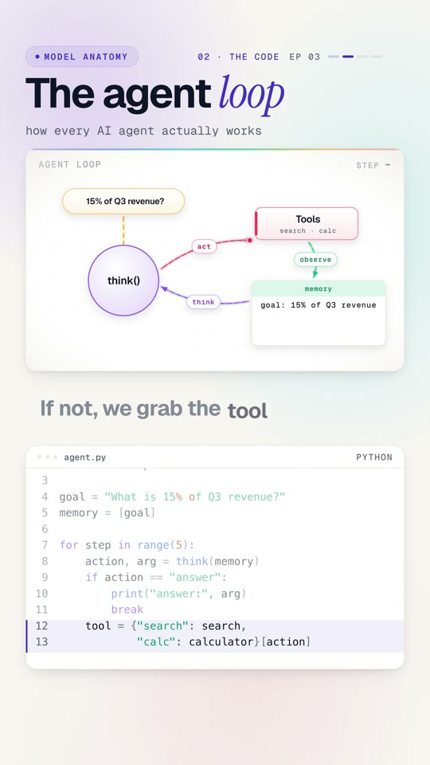

# 03 · The AI agent loop



**Every AI agent runs on one tiny loop: think, act, observe, repeat.** Finance asks "what is 15% of Q3 revenue?".
The model alone can't know that number, so we give it tools, let it decide what to do at each step, and write what
it learns back into memory. Three steps later it answers: $630,000.

Watch: [YouTube](https://www.youtube.com/@datanatomyai) · [TikTok](https://www.tiktok.com/@datanatomy.ai) · [Instagram](https://www.instagram.com/datanatomy.ai) (83 seconds)

<br clear="right">

## The idea

An agent is a language model in a loop:

1. **Think:** the model reads everything in memory and picks an action, like "search for Q3 revenue".
2. **Act:** your code runs the tool it asked for.
3. **Observe:** the result goes back into memory, so the next thought knows more.

The loop stops when the model decides it can answer, or when it hits a step limit.

## Run it

```bash
python3 agent.py
```

```
0 search -> Q3 revenue: 4200000
1 calc -> 630000.0
answer: $630,000
```

## The files

- `agent.py`: the loop (the file in the video).
- `tools.py`: two tools. `search` looks a number up in a tiny "warehouse", `calculator` multiplies.
- `model.py`: `think()`, a **stand-in for the LLM**. It follows simple rules so the example runs offline and gives
  the same answer every time. In a real agent, `think()` is one API call to a model that returns the same
  `(action, argument)` shape.

## The code

| Line | Code | What it does |
|------|------|--------------|
| 1 | `from tools import search, calculator` | The agent's tools. In a company these are real APIs. |
| 2 | `from model import think` | The "brain". Here a stand-in, in production an LLM call. |
| 4 | `goal = "What is 15% of Q3 revenue?"` | The question from finance. |
| 5 | `memory = [goal]` | Memory starts with just the goal. |
| 7 | `for step in range(5):` | At most 5 steps. This is the guardrail (more below). |
| 8 | `action, arg = think(memory)` | Think: read memory, pick the next action. |
| 9 to 11 | `if action == "answer": ... break` | If the model is ready, print the answer and stop. |
| 12 to 13 | `tool = {...}[action]` | Otherwise look up the tool it asked for. |
| 14 | `result = tool(arg)` | Act: run the tool. |
| 15 | `memory.append(result)` | Observe: write the result into memory. |
| 16 | `print(step, action, "->", result)` | Show each step. |

## Why line 7 matters

`range(5)` is a guardrail. A real model can get confused and keep calling tools forever, burning time and money.
Production agents always have limits: on steps, on tokens, on cost, and on which tools they may call.

## Try this

1. Ask for Q2 instead: change the goal and update `model.py` so the search uses "Q2 revenue".
2. Add a third tool, for example `format_currency`, and make `think()` use it before answering.
3. Break the guardrail: make `think()` never return `"answer"`. What happens with and without `range(5)`?
4. Replace `think()` with a real LLM call that returns JSON like `{"action": "search", "arg": "Q3 revenue"}`.

---
Previous: [02 · K-means](../02-k-means) · Next: [04 · Ontologies](../04-ontology) · [All lessons](../README.md)
