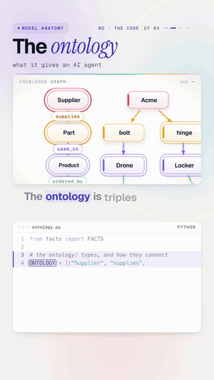

# 04 · What an ontology gives an AI agent

   



**Why your AI agent can't connect the dots.** "Supplier Acme is late. Which customers are affected?" The answer is
spread over three systems: purchasing, product data and orders. An ontology names the links between them, so the
agent can follow the chain: supplier → part → product → customer. Three hops later: Kestrel and Orbis, with the
path as proof.

Watch: [YouTube](https://www.youtube.com/@datanatomyai) · [TikTok](https://www.tiktok.com/@datanatomy.ai) · [Instagram](https://www.instagram.com/datanatomy.ai) (92 seconds, plus a 34-second short)

<br clear="right">

## The idea

- **Facts** are triples: `(subject, relation, object)`, like `("Acme", "supplies", "bolt")`.
- **The ontology** says what kinds of things exist and how they may connect: a Supplier *supplies* a Part, a Part
  is *used_in* a Product, a Product is *ordered_by* a Customer.

With the ontology, a multi-hop question becomes a walk along named relations. Without it, an agent searching
separate tables for "Acme" finds the supplier row and stops there.

## Run it

```bash
python3 src/ontology.py
```

```
supplies -> ['bolt', 'hinge']
used_in -> ['Drone', 'Locker']
ordered_by -> ['Kestrel', 'Orbis']
affected: ['Kestrel', 'Orbis']
```

The short version (`short/ontology.py`, 7 lines) prints only the last line.

## Files

```
04-ontology/
├── data/
│   └── facts.csv         10 facts: subject, relation, object
├── src/
│   ├── ontology.py       the code from the video
│   └── facts.py          loads facts.csv
└── short/
    ├── ontology.py       the 7-line version from the short
    └── facts.py
```

The long and short versions read the same `data/facts.csv`.

`facts.csv` holds 10 triples, the kind of rows you'd pull from an ERP (purchasing), a PLM (product data) and a CRM
(orders).

## The code

`src/ontology.py`, line by line:

| Line | Code | What it does |
|------|------|--------------|
| 1 | `from facts import FACTS` | The instance data: 10 triples. |
| 3 to 6 | `ONTOLOGY = [...]` | The schema: three typed relations that chain Supplier → Part → Product → Customer. |
| 8 | `def follow(start, path):` | Walk from a starting entity along a list of relations. |
| 9 | `found = {start}` | Begin at the late supplier. |
| 10 | `for rel in path:` | One hop per relation. |
| 11 to 12 | `found = {o for s, r, o in FACTS if s in found and r == rel}` | Everything reachable from what we've found, using this relation. |
| 13 | `print(rel, "->", sorted(found))` | Show each hop. This is the "path as proof". |
| 16 | `path = [rel for _, rel, _ in ONTOLOGY]` | The relation chain, read straight from the ontology. |
| 17 | `print("affected:", follow("Acme", path))` | Ask the question. |

Vela is not affected: it orders the Pump, which uses a gasket from Zenco, not Acme.

## Why it matters

Real companies run on many systems that name the same things differently. An ontology gives an agent shared meaning
across them. The agent hallucinates less, because it follows real links instead of guessing, and every answer can
show its path, which makes it auditable.

## Try this

1. Make Zenco the late supplier. Who is affected?
2. Add a fact: `("bolt", "used_in", "Pump")`. Does Vela become affected?
3. Add a fourth relation, like `("Customer", "located_in", "Region")`, and ask which regions are affected.
4. Change `follow` to also return the full path for each customer, not just the final set.

---
Previous: [03 · The AI agent loop](../03-ai-agent-loop) · Next: [05 · Evals and loop engineering](../05-evals-loop-engineering) · [All lessons](../README.md)
