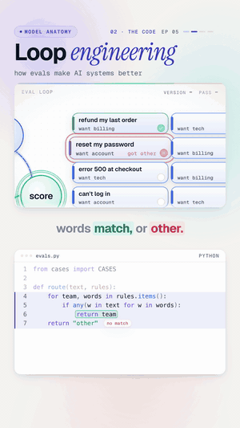

# 05 · Evals and loop engineering

   



**From 60% to 100% without guessing.** A support-ticket router sends tickets to the right team. Instead of hoping
a change helps, we build an eval set of 10 labeled tickets, score the router, read the failures, fix them, and score
again: 60%, then 80%, then 100%. The eval set then stays as a gate, so a future change can't quietly break it.

Watch: [YouTube](https://www.youtube.com/@datanatomyai) · [TikTok](https://www.tiktok.com/@datanatomy.ai) · [Instagram](https://www.instagram.com/datanatomy.ai) (100 seconds, plus a 34-second short)

<br clear="right">

## The idea

Loop engineering is the habit of improving an AI system with measurements, not vibes:

1. **Run** the system on a fixed set of examples with known right answers (the *eval set*).
2. **Score** it: the pass rate.
3. **Fix** what the failures tell you.
4. **Rerun** and compare.

Teachers grading practice tests work the same way. The eval set is the practice test; the pass rate is the grade.

## Run it

```bash
python3 src/evals.py
```

```
v1 pass rate 60%
v2 pass rate 80%
v3 pass rate 100%
```

The short version (`short/loop.py` with `short/tickets.py`) prints `60% pass`, `80% pass`, `100% pass`.

## Files

```
05-evals-loop-engineering/
├── data/
│   └── cases.csv         the eval set: 10 tickets and the right team
├── src/
│   ├── evals.py          the code from the video
│   └── cases.py          loads cases.csv
├── short/
│   ├── loop.py           the 7-line version from the short
│   └── tickets.py        cases, router and three rule versions
└── tests/
    └── test_evals.py
```

The eval set is data, not code, so anyone (including people who don't write Python) can add a ticket to
`cases.csv`. Run the tests with `pytest` from this folder. They check the code still prints exactly what the video shows.

## The code

`src/evals.py`, line by line:

| Line | Code | What it does |
|------|------|--------------|
| 1 | `from cases import CASES` | The eval set. |
| 3 to 7 | `def route(text, rules): ...` | The system under test: the first team whose keyword appears wins, otherwise `"other"`. A **stand-in for an LLM prompt**: in production this is a model call. |
| 9 to 13 | `def score(v, rules): ...` | Run every case, collect the failures, print the pass rate. |
| 15 to 16 | `rules = {...}` | Version 1: billing and tech keywords. |
| 17 | `score("v1", rules)` | 60%. The password, log-in and invoice tickets fail. |
| 18 | `rules["account"] = [...]` | Fix 1: add an account team for passwords and log-ins. |
| 19 | `score("v2", rules)` | 80%. The two invoice tickets still fail. |
| 20 | `rules["billing"].append("invoice")` | Fix 2: invoices go to billing. |
| 21 | `score("v3", rules)` | 100%. |

## Why it matters

The same loop works for prompts, agents and RAG systems. Keep the eval set and run it on every change: if the pass
rate drops, the change doesn't ship. Teams track this number the way they track uptime. A 10-case set is a start;
real eval sets grow every time production finds a new failure.

## Try this

1. Print the failing tickets in `score()`, not just the rate. Reading failures is the "fix" step.
2. Add the ticket `("charged but no invoice", "billing")`. Does v3 still pass?
3. Add a tricky case: `("error in my invoice", "billing")`. Which team wins, and why does keyword order matter?
4. Swap `route()` for a real LLM call and see if your pass rate holds.

---
Previous: [04 · Ontologies](../04-ontology) · Next: [06 · RAG from scratch](../06-rag) · [All lessons](../README.md)
