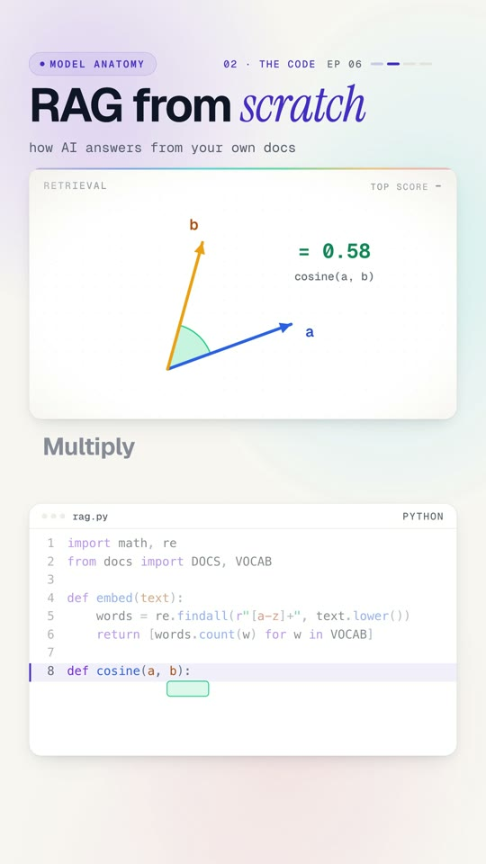

# 06 · RAG from scratch



**Your AI never read your handbook.** Ask it how many vacation days new hires get and it will guess.
Retrieval-augmented generation (RAG) fixes that: find the most relevant piece of your own documents, put it in the
prompt, and answer from it, with the source. Here the best match scores 0.91 and the answer is 15 days.

Watch: [YouTube](https://www.youtube.com/@datanatomyai) · [TikTok](https://www.tiktok.com/@datanatomy.ai) · [Instagram](https://www.instagram.com/datanatomy.ai) (95 seconds, plus a 30-second short)

<br clear="right">

## The idea

RAG is an open-book exam:

1. **Chunk** your documents into small pieces.
2. **Embed** every chunk: turn its meaning into a list of numbers (a vector).
3. **Embed the question** the same way.
4. **Retrieve** the chunks whose vectors point the same way as the question's (cosine similarity).
5. **Prompt** the model with those chunks plus the question, and cite where the answer came from.

## Run it

```bash
python3 src/rag.py
```

```
hr-1 0.91 New hires get 15 vacation days a year
it-1 0.55 New hires get a laptop on day one
sources: hr-1 it-1
```

The short version (`short/rag.py`) keeps only the best chunk:

```
New hires get 15 vacation days a year
source: hr-1 0.91
```

## Files

```
06-rag/
├── data/
│   └── handbook.json     8 chunks of HR, IT and finance policy
├── src/
│   ├── rag.py            the code from the video
│   └── docs.py           loads the chunks, builds the vocabulary
├── short/
│   ├── rag.py            the version from the short
│   └── docs.py           same, plus embed() and cosine()
└── tests/
    └── test_rag.py
```

`handbook.json` holds the chunks, and `docs.py` builds the vocabulary from them: every word in the docs except filler
words like "the" and "in". Run the tests with `pytest` from this folder. They check the code still prints exactly what the video shows.

## The code

`src/rag.py`, line by line:

| Line | Code | What it does |
|------|------|--------------|
| 1 to 2 | imports | `math` and `re`, plus the chunks and vocabulary. |
| 4 to 6 | `def embed(text): ...` | A **toy embedding**: count how often each vocabulary word appears. Real systems use a learned embedding model, which captures meaning, not just shared words. |
| 8 to 10 | `def cosine(a, b): ...` | How much two vectors point the same way: 1.0 means identical direction, 0 means nothing in common. |
| 12 | `ask = "..."` | The employee's question. |
| 13 | `q = embed(ask)` | The question as a vector. |
| 14 to 15 | `scores = {...}` | Score every chunk against the question. |
| 16 to 17 | `top = sorted(...)[:2]` | Keep the two best chunks. |
| 18 | `context = ...` | Join them into one block of text. |
| 19 | `prompt = ...` | Context + question: what you'd send to the model. |
| 20 to 22 | prints | Each retrieved chunk with its score, then the sources. |

## Look closely at the second result

`it-1` ("New hires get a laptop on day one") scores 0.55 because it shares the words "new", "hires" and "get" with
the question, not because it's about vacation. That's the weakness of word-count embeddings, and the reason
production RAG uses learned embeddings and often a reranker.

## Why it matters

RAG lets an assistant answer from wikis, tickets, contracts and policies it was never trained on. Update a document
and the next answer uses it, with no retraining. Because you control what can be retrieved, you can also enforce
access rules, for example never retrieving finance documents for people outside finance.

## Try this

1. Ask "Do I need approval for sick days?" Which chunk wins?
2. Add a chunk to `handbook.json`: `"hr-5": "Interns get 10 vacation days"`. Rerun the original question. What changes?
3. Remove `"get"` from the vocabulary (add it to `STOP` in `docs.py`). Does `it-1` still come second?
4. Send `prompt` to a real LLM and compare its answer with and without the context.

---
Previous: [05 · Evals and loop engineering](../05-evals-loop-engineering) · Next: [07 · Linear regression, no libraries](../07-linear-regression-no-libraries) · [All lessons](../README.md)
