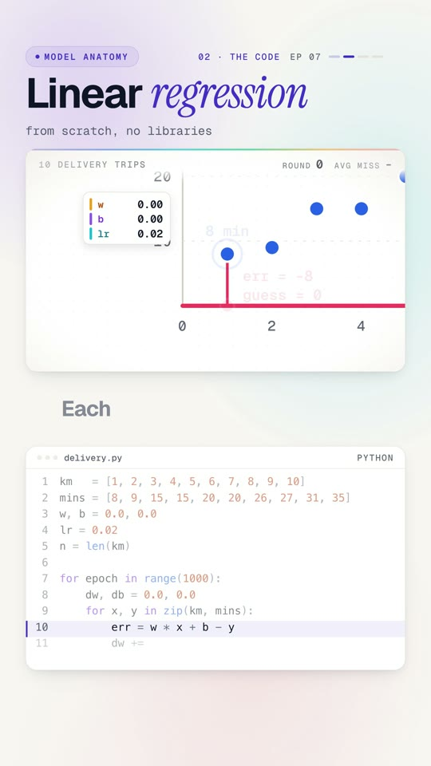

# 07 · Linear regression, no libraries



**15 lines of Python that learn. No imports.** Ten delivery trips, each with a distance and a time. Start with a flat
line, measure every error, nudge two numbers, repeat a thousand times. The program learns
`minutes = 2.98 × km + 4.21` and predicts that a 12 km trip takes 39.9 minutes.

Watch: [YouTube](https://www.youtube.com/@datanatomyai) · [TikTok](https://www.tiktok.com/@datanatomy.ai) · [Instagram](https://www.instagram.com/datanatomy.ai) (80 seconds, plus a 32-second short)

<br clear="right">

## The idea

This is lesson 00 again, with every step written out by hand, so nothing hides inside NumPy:

1. **Guess** a time for every trip with the current line.
2. **Check**: how far off was each guess?
3. **Nudge** `w` and `b` a little in the direction that shrinks the error.
4. **Repeat**.

Guess, check, nudge. The same loop trains every neural network; they just have far more numbers to nudge.

## Run it

```bash
python3 delivery.py
```

```
mins = 2.98 * km + 4.21
12 km: 39.9 min
```

The short version (`short/learn.py`, 9 lines) nudges after every single trip instead of after each full pass, and
prints `12 km: 40.1 min`.

## The code

| Line | Code | What it does |
|------|------|--------------|
| 1 to 2 | `km = [...]`, `mins = [...]` | The data: ten trips. |
| 3 | `w, b = 0.0, 0.0` | Start flat. `w` = minutes per km, `b` = fixed minutes per trip (parking, handover). |
| 4 | `lr = 0.02` | Learning rate: the size of each nudge. |
| 5 | `n = len(km)` | Number of trips, for averaging. |
| 7 | `for epoch in range(1000):` | A thousand passes over the data. |
| 8 | `dw, db = 0.0, 0.0` | Start this pass's tally of how to move `w` and `b`. |
| 9 | `for x, y in zip(km, mins):` | Visit every trip. |
| 10 | `err = w * x + b - y` | Guess minus truth for this trip. |
| 11 | `dw += err * x / n` | How much `w` is to blame. Long trips count more. |
| 12 | `db += err / n` | How much `b` is to blame. |
| 13 to 14 | `w -= lr * dw`, `b -= lr * db` | The nudge. |
| 16 | `print(...)` | The line it learned. |
| 17 | `print(...)` | A prediction for a trip it has never seen. |

`dw` and `db` are the gradient of the mean squared error, written out by hand (up to a factor of 2, which the
learning rate absorbs).

## What breaks it

In the video, raising the learning rate to `0.06` makes the numbers explode instead of settling. Each step
overshoots the bottom by more than the last. Picking a learning rate is a real part of training models.

## Why use a model this simple?

Linear models are fast, cheap and explainable: "each km adds about 3 minutes" is something a dispatcher can check.
Forecasting, pricing and capacity planning still use them every day, often as the baseline every fancier model has
to beat.

## Try this

1. Set `lr = 0.06` and print `w` every 100 epochs. Watch it blow up.
2. Predict a 30 km trip. Do you trust that number? (It's far outside the data.)
3. Add an 11th trip that is way off, like `(5, 60)`. How much does one outlier move the line?
4. Compare with `numpy.polyfit(km, mins, 1)`. Same answer?

---
Previous: [06 · RAG from scratch](../06-rag) · Next: [Build Lab 01 · API to Parquet](../build-lab/01-api-to-parquet) · [All lessons](../README.md)
