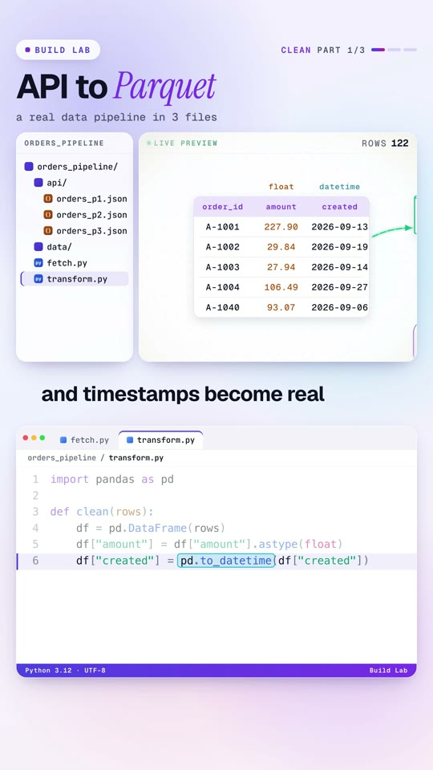

<p align="center">
  
</p>

<p align="center">
  <a href="https://www.youtube.com/@datanatomyai">YouTube</a> ·
  <a href="https://www.tiktok.com/@datanatomy.ai">TikTok</a> ·
  <a href="https://www.instagram.com/datanatomy.ai">Instagram</a> ·
  <a href="https://x.com/datanatomyai">X</a> ·
  <a href="https://www.linkedin.com/company/datanatomy">LinkedIn</a> ·
  <a href="https://www.threads.net/@datanatomy.ai">Threads</a>
</p>

# Model Anatomy

The code behind every Datanatomy video. Each lesson is a short, real program you can run in a few seconds,
paired with a video that walks through it line by line while an animation shows what each line does.

No black boxes: the models here are small enough to read in one sitting, and the numbers you see in the videos are
the numbers these files print.

<!-- latest:start -->
## Latest video

<a href="build-lab/01-api-to-parquet"></a>

**Build Lab, Part 1: API to Parquet**

Build a real data pipeline in three Python files: fetch paginated JSON from an API, clean it with pandas,
write Parquet, and query it with DuckDB. 19.0 KB of JSON becomes 5.6 KB of Parquet.

Watch: [YouTube](https://www.youtube.com/@datanatomyai) · [TikTok](https://www.tiktok.com/@datanatomy.ai) · [Instagram](https://www.instagram.com/datanatomy.ai)
Code: [`build-lab/01-api-to-parquet`](build-lab/01-api-to-parquet)

<br clear="left">
<!-- latest:end -->

## Lessons

### Model Anatomy: how ML and AI work from the inside

| # | Lesson | You'll learn | Video |
|---|--------|--------------|-------|
| 00 | [Machine learning](00-machine-learning) | What "learning from examples" means, with a line that fits itself to 40 house prices | 35s |
| 01 | [Gradient descent](01-gradient-descent) | How every model improves: feel the slope, take a small step, repeat | 32s |
| 02 | [K-means clustering](02-k-means) | Finding groups in data nobody labeled | 31s |
| 03 | [The AI agent loop](03-ai-agent-loop) | Think, act, observe: the loop behind every AI agent, with tools and a guardrail | 83s |
| 04 | [Ontologies for AI agents](04-ontology) | Why agents need named relationships to answer multi-hop questions | 92s + 34s |
| 05 | [Evals and loop engineering](05-evals-loop-engineering) | Measuring an AI system, fixing it, and keeping it from breaking again | 100s + 34s |
| 06 | [RAG from scratch](06-rag) | How an assistant answers from your own documents, with a source | 95s + 30s |
| 07 | [Linear regression, no libraries](07-linear-regression-no-libraries) | The full training loop in plain Python, and what breaks it | 80s + 32s |

### Build Lab: real projects, built step by step

| # | Project | You'll build | Video |
|---|---------|--------------|-------|
| 01 | [API to Parquet](build-lab/01-api-to-parquet) | A three-file data pipeline: API pages to a clean, typed, queryable Parquet file | 99s |

New to this? Start with the [learning path](docs/learning-path.md).

## Run the code

You need Python 3.10 or newer.

```bash
git clone https://github.com/<your-username>/model-anatomy.git
cd model-anatomy
python3 -m venv .venv && source .venv/bin/activate
pip install -r requirements.txt

cd 03-ai-agent-loop
python3 agent.py
```

Lessons 03, 04, 05, 06 and 07 use only the Python standard library. Lessons 00 to 02 need NumPy, and the Build Lab
project needs pandas, PyArrow and DuckDB. More detail in [docs/setup.md](docs/setup.md).

## How each lesson is organized

```
03-ai-agent-loop/
├── README.md     the idea, how to run it, a line-by-line walkthrough, and things to try
├── agent.py      the file from the video (same lines, same line numbers)
├── model.py      helpers the video imports
└── tools.py
```

Lessons with a 30-second version keep that code in a `short/` folder. The code matches the video exactly so you can
pause on any frame and find the same line here.

## Docs

- [Learning path](docs/learning-path.md): what to watch and run, in order
- [Setup](docs/setup.md): Python, virtual environments, and troubleshooting
- [Glossary](docs/glossary.md): every term used in the videos, in plain words

## License

[MIT](LICENSE). Use the code to learn, teach, or build. A link back to the channel is appreciated.
