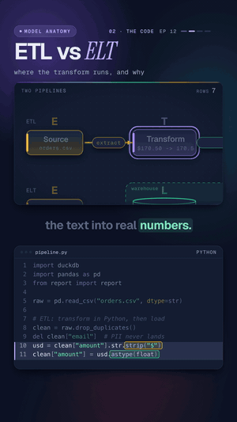

# 12 · ETL vs ELT

   



**Same three letters, different order, and it changes your whole data platform.** One messy export of 8 rows
(amounts stored as text with a `$`, one order exported twice, an email column full of personal data) goes through
two pipelines. ETL cleans it in pandas and loads only the result. ELT loads the raw rows into the warehouse and
cleans them there with SQL. Both end with 7 orders worth $1,117.15, but only ELT still holds the raw data and the
emails.

Watch: [YouTube](https://www.youtube.com/@datanatomyai) · [TikTok](https://www.tiktok.com/@datanatomy.ai) · [Instagram](https://www.instagram.com/datanatomy.ai) (138 seconds)

<br clear="right">

## The idea

Every pipeline does three things: **E**xtract data from a source, **T**ransform it (fix types, remove duplicates,
drop or mask sensitive fields), and **L**oad it into a warehouse. The difference is where the T happens.

1. **ETL**: extract, transform outside the warehouse (here in Python), then load only the clean result.
2. **ELT**: extract, load the raw data into the warehouse as it is, then transform it with SQL inside the warehouse.

ELT became common because cloud storage got cheap and warehouses got powerful. Keeping the raw table means that when
business logic changes, you re-run the SQL. You don't extract the data again. ETL still wins when sensitive data
must be cleaned or masked before it lands anywhere, or when the target is small or expensive. Many teams mix both.

## Run it

```bash
pip install pandas duckdb
cd src
python3 pipeline.py
```

```
ETL orders: 7 rows, total $1,117.15
ETL tables: orders
ELT orders: 7 rows, total $1,117.15
ELT tables: orders, raw_orders
same total: True | raw + PII kept: ELT
```

Like the video, `pipeline.py` opens `orders.csv` by a relative name, so run it from inside `src/`.
`src/orders.csv` is already included. To regenerate it (same seed, same rows), run `python3 scripts/make_orders.py`
from the lesson folder.

## Files

```
12-etl-vs-elt/
├── scripts/
│   └── make_orders.py    writes src/orders.csv (seeded, 8 rows)
└── src/
    ├── pipeline.py       the code from the video
    ├── report.py         prints what each warehouse holds
    └── orders.csv        the raw export: order_id, amount, email
```

`orders.csv` sits next to `pipeline.py` because the on-screen code reads it by name, exactly as in the video. The
reporting lives in `report.py` so the video file can stay at 22 lines and show only the two pipelines.

The raw data:

```
order_id,amount,email
101,$170.50,ana@mail.com
102,$103.14,ben@mail.com
103,$230.44,chen@mail.com
104,$188.38,dina@mail.com
104,$188.38,dina@mail.com
105,$233.36,eli@mail.com
106,$129.61,fay@mail.com
107,$61.72,gus@mail.com
```

## The code

`src/pipeline.py`, line by line:

| Line | Code | What it does |
|------|------|--------------|
| 1 to 3 | `import duckdb` ... `from report import report` | DuckDB is the warehouse, pandas does the ETL transform, `report` prints the results. |
| 5 | `raw = pd.read_csv("orders.csv", dtype=str)` | Extract. Both paths start from the same 8 rows, read as plain text, as a raw export would be. |
| 7 | `# ETL: transform in Python, then load` | The ETL path starts here. |
| 8 | `clean = raw.drop_duplicates()` | Removes the second copy of order 104. 8 rows become 7. |
| 9 | `del clean["email"]` | Deletes the PII column before anything is loaded. |
| 10 to 11 | `usd = clean["amount"].str.strip("$")` / `clean["amount"] = usd.astype(float)` | Strips the `$` and turns the text into real numbers. |
| 12 | `etl = duckdb.connect()` | An in-memory DuckDB database: the ETL warehouse. |
| 13 | `etl.sql("CREATE TABLE orders AS FROM clean")` | Load. Only the clean table ever reaches this warehouse. |
| 15 | `# ELT: load raw as-is, then transform in SQL` | The ELT path starts here. |
| 16 | `elt = duckdb.connect()` | A second, separate warehouse, so we can compare what each path keeps. |
| 17 | `elt.sql("CREATE TABLE raw_orders AS FROM raw")` | Load first: all 8 raw rows, duplicate and emails included. |
| 18 to 21 | `CREATE TABLE orders AS SELECT DISTINCT order_id, CAST(LTRIM(amount, '$') AS DOUBLE) AS amount FROM raw_orders` | Transform inside the warehouse. `DISTINCT` drops the duplicate, `LTRIM` removes the `$`, `CAST` makes a number, and `email` is simply never selected. |
| 22 | `report(etl, elt)` | Prints rows, totals and tables for each warehouse. |

`report.py` runs `SHOW TABLES` and `SELECT count(*), sum(amount) FROM orders` on each warehouse, and checks
`information_schema.columns` for any column named `email`. Its last line compares the two totals (rounded to cents)
and names the warehouse that still holds raw data with PII.

## `CREATE TABLE ... AS FROM x`

Lines 13 and 17 use a DuckDB shorthand. In DuckDB a query may start with `FROM`, and `FROM x` on its own means
`SELECT * FROM x`. So these two lines do the same thing:

```sql
CREATE TABLE orders AS FROM clean
CREATE TABLE orders AS SELECT * FROM clean
```

The shorthand is DuckDB-specific. In Postgres, Snowflake or BigQuery, write the `SELECT *` version.

The other surprise is that `clean` and `raw` are pandas DataFrames, not tables. DuckDB's Python API finds a Python
variable with that name and reads the DataFrame directly (a "replacement scan"). That is the whole load step here.
In production, the load would be a bulk copy into a real warehouse.

## What the video simplified

- **Extract is a CSV file.** A real extract pulls from an API, a production database or files landing in object
  storage.
- **`DISTINCT` is not the same as `drop_duplicates()` on an ID.** Both remove the duplicate here because the two
  copies of order 104 are identical. If the copies differed (say, a new amount), both would keep two rows. A real
  pipeline would deduplicate on the key, for example with `QUALIFY ROW_NUMBER() OVER (PARTITION BY order_id ...) = 1`.
- **Dropping email is the bluntest option.** Teams often mask or hash PII instead, so it can still be joined on
  without being readable. ETL is the right place to do that when the rules say raw PII must never be stored.
- **The ELT transform is one SQL statement.** In practice it is many versioned SQL models. Tools like dbt manage
  them, which is ELT: the T runs as SQL in the warehouse.

## Try this

1. Change the second copy of order 104 in `orders.csv` to a different amount. How many rows does each path keep
   now, and do the totals still match?
2. Replace line 9 with a mask, for example `clean["email"] = "***"`. What does the last printed line say now?
3. The business decides orders under $100 no longer count. Add a `WHERE` to the ELT SQL. Which path can apply the new
   rule without reading the CSV again, and why?
4. Rewrite lines 13 and 17 with `SELECT *` instead of `AS FROM`. Is the output identical?

---
Previous: [11 · Choosing a model](../../machine-learning/11-choosing-a-model) · Next: [13 · PySpark](../13-pyspark) · [All lessons](../../README.md)
