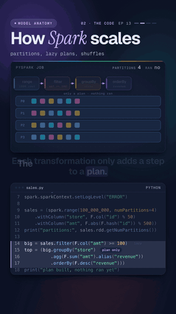

# 13 · PySpark: data too big for one machine

   



**Your laptop chokes on a billion rows. Spark splits the job across many machines.** This lesson builds 100 million
sales rows inside Spark, cut into 4 partitions, and asks which of 50 stores sells the most. The filter, the groupBy
and the sort only build a plan. Nothing runs until `take(3)` asks for a result, and then store 3 wins with
$479,607,696.

Watch: [YouTube](https://www.youtube.com/@datanatomyai) · [TikTok](https://www.tiktok.com/@datanatomy.ai) · [Instagram](https://www.instagram.com/datanatomy.ai) (108 seconds)

<br clear="right">

## The idea

Spark is an engine for data that is too big or too slow for one computer. It rests on four ideas:

1. **Partitions.** A DataFrame is cut into slices. Each core (on a laptop) or each machine (on a cluster) works on
   its own slice, at the same time.
2. **Transformations are lazy.** `filter`, `withColumn`, `groupBy` and `orderBy` don't touch the data. Each one adds
   a step to a plan.
3. **Actions run the plan.** `show`, `collect`, `count`, `take` and `write` need a real answer, so Spark optimizes
   the whole plan and runs it.
4. **A groupBy needs a shuffle.** Rows for the same store sit in different partitions. To add them up, Spark moves
   them over so each store's rows end up in one partition.

The same code runs on 4 laptop cores (`local[4]`) or on a cluster of hundreds of machines.

## Run it

You need Java (17 or 21) and PySpark 3.5. Spark runs on the Java Virtual Machine, so `pip` alone is not enough.

```bash
java -version                 # should print 17 or 21
pip install pyspark==3.5.4
python3 src/sales.py
```

On macOS, `brew install openjdk@21` installs Java. If `java -version` still fails, point `JAVA_HOME` at it (see the
Homebrew message after installing).

```
partitions: 4
plan built, nothing ran yet
store  3: $479,607,696
store  8: $479,533,553
store 44: $479,531,298
top store: 3
```

The run takes about 5 to 7 seconds on a laptop (Apple M3 Pro), most of it starting Spark. Spark also prints a few
`WARN` lines and a progress bar like `[Stage 0:> (0 + 4) / 4]` on stderr: 4 tasks, one per partition. To see only
the program's output, run `python3 src/sales.py 2>/dev/null`.

## Files

```
13-pyspark/
└── src/
    └── sales.py      the 22 lines from the video
```

There is no `data/` folder. The 100 million rows are generated inside Spark by `spark.range`, so nothing is
downloaded or written to disk, and the numbers are the same on every run.

## The code

`src/sales.py`, line by line:

| Line | Code | What it does |
|------|------|--------------|
| 1 to 2 | `from pyspark.sql import ...` | The Spark entry point and the column functions, imported as `F`. |
| 4 | `spark = (SparkSession.builder.master("local[4]")` | Start Spark on this machine with 4 worker threads (4 cores). |
| 5 | `.config("spark.ui.enabled", "false")` | Skip the web dashboard Spark normally starts on port 4040. |
| 6 | `.getOrCreate())` | Return the session (or the one already running). |
| 7 | `spark.sparkContext.setLogLevel("ERROR")` | Hide Spark's log lines from here on. |
| 9 | `sales = (spark.range(100_000_000, numPartitions=4)` | A DataFrame with one column, `id`, from 0 to 99,999,999, split into 4 partitions of 25 million rows. |
| 10 | `.withColumn("store", F.col("id") % 50)` | Each row gets a store number from 0 to 49. |
| 11 | `.withColumn("amt", F.abs(F.hash("id")) % 500))` | And a sale amount from 0 to 499. `hash` is fixed (Murmur3), so it is the same on every run and every machine. |
| 12 | `print("partitions:", sales.rdd.getNumPartitions())` | Prints 4. Counting partitions reads the plan, it runs no job. |
| 14 | `big = sales.filter(F.col("amt") >= 100)` | Keep sales of 100 or more. Lazy: only a plan step. |
| 15 to 17 | `top = (big.groupBy("store") .agg(...) .orderBy(...))` | Revenue per store, biggest first. Also lazy. |
| 18 | `print("plan built, nothing ran yet")` | True: at this point Spark has run zero jobs. |
| 19 | `rows = top.take(3)` | The action. Spark runs the whole plan and returns the top 3 rows to Python. |
| 20 to 21 | `for r in rows: print(...)` | One line per store, with thousands separators. |
| 22 | `print("top store:", rows[0].store)` | The winner. |

## What happens when take(3) runs

You can print the plan Spark built with `top.explain()`. Read it from the bottom up:

1. **Range** makes the rows, 4 splits.
2. **Filter** drops the small sales, inside each partition.
3. **HashAggregate (partial_sum)** adds up each store's sales *inside each partition first*. After this step each
   partition holds at most 50 small totals, not 25 million rows.
4. **Exchange hashpartitioning(store)** is the shuffle. The partial totals move so all totals for one store meet
   in the same partition.
5. **HashAggregate (sum)** adds the partial totals into one per store.
6. The sort and the top 3.

Step 3 is why the shuffle in this lesson is cheap: Spark moves 200 partial totals, not 100 million rows. A shuffle
of raw rows (a join of two big tables, for example) writes data to disk and sends it over the network, and it is
usually the slowest part of a Spark job.

## What the video simplified

- **The shuffle went into 4 lanes.** Spark actually shuffles into 200 partitions by default
  (`spark.sql.shuffle.partitions`), and adaptive query execution merges the small ones at run time. The idea is the
  same: one store's rows always land in one partition.
- **A laptop is not a cluster.** `local[4]` runs everything in one process on 4 threads. On a cluster, the
  platform (Databricks, EMR, Dataproc) sets the master for you, so you leave out `.master("local[4]")` and the rest
  of the code stays the same.
- **100 million rows, not a billion.** This job fits on a laptop because Spark streams through each partition and
  keeps only running totals. Change `100_000_000` to `1_000_000_000` and it still runs, only slower.

## Try this

1. Add `top.explain()` before line 19. Can you find the `Exchange` (the shuffle) and the `partial_sum`?
2. Change `numPartitions=4` to `numPartitions=1`. Does the answer change? Does the progress bar?
3. Remove line 19 to 22 and run it. Does the progress bar appear at all, and what does that tell you about lazy
   transformations?
4. Add `print(big.count())` after line 14. How many sales are 100 or more, and where does the program now spend
   its time?

---
Previous: [12 · ETL vs ELT](../12-etl-vs-elt) · Next: [14 · Polars](../14-polars) · [All lessons](../../README.md)
