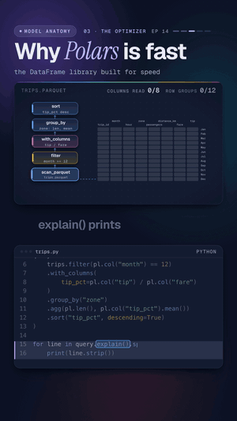

# 14 · Why Polars is fast

   



**Same question, same data. One library reads the whole file, the other reads only what it needs.** We ask which
taxi zone tips best in December, over 1.2 million trips in a Parquet file. The lazy Polars query reads 4 of the 8
columns and 1 of the 12 row groups, and the answer is Uptown, at 19.0%.

Watch: [YouTube](https://www.youtube.com/@datanatomyai) · [TikTok](https://www.tiktok.com/@datanatomy.ai) · [Instagram](https://www.instagram.com/datanatomy.ai) (118 seconds)

<br clear="right">

## The idea

Polars is a DataFrame library written in Rust. It runs on all your CPU cores and keeps data in columns, in the
Apache Arrow memory format. Its lazy API works in three steps:

1. **Describe the work.** `scan_parquet` reads no rows. It starts a query plan. Each method you chain on it
   (`filter`, `with_columns`, `group_by`, `sort`) adds a step to the plan, and `pl.col(...)` expressions say what to
   compute, not how.
2. **Let the optimizer rewrite the plan.** Two rewrites matter most here:
   - **Predicate pushdown**: the filter moves into the scan, so rows are filtered while the file is read. Parquet
     stores the min and max of each column per row group, so whole row groups that cannot match are skipped.
   - **Projection pushdown**: only the columns the query uses are read.
3. **Run it.** `collect()` executes the optimized plan, in parallel.

## Run it

You need `polars` and `numpy` (`pip install polars numpy`). Generate the data first, then run the query from
inside `src/`, because the code opens `trips.parquet` by its file name:

```bash
python3 scripts/make_trips.py
cd src
python3 trips.py
```

```
wrote trips.parquet: 1,200,000 rows x 8 columns
```

```
PROJECT 4/8 COLUMNS
SELECTION: col("month") == 12
Uptown    16,678 trips  19.0% tip
Airport   16,421 trips  17.0% tip
Downtown  16,664 trips  15.5% tip
Best tippers in December: Uptown
```

Tested with Polars 1.44. The text of `explain()` can change between Polars versions, so lines 15 and 16 may print
different lines in another version. The answer will not change.

## Files

```
14-polars/
├── scripts/
│   └── make_trips.py     writes src/trips.parquet: 1.2M seeded trips, 8 columns, one row group per month
├── src/
│   ├── trips.py          the code from the video
│   └── trips.parquet     generated, about 10 MB, not committed
└── .gitignore            keeps trips.parquet out of git
```

The data is generated, not downloaded: a fixed random seed makes every run produce the same file and the same
output. The trips are stored in time order with one row group per month, the way event data usually lands. That
layout is what lets the December filter skip 11 of the 12 row groups.

## The code

`src/trips.py`, line by line:

| Line | Code | What it does |
|------|------|--------------|
| 1 | `import polars as pl` | Polars, imported as `pl` by convention. |
| 3 | `trips = pl.scan_parquet("trips.parquet")` | A LazyFrame. It reads the file's schema, but no rows. |
| 5 to 6 | `query = ( trips.filter(pl.col("month") == 12)` | Keep December. `pl.col("month") == 12` is an expression: a description of work. |
| 7 to 9 | `.with_columns(tip_pct=pl.col("tip") / pl.col("fare"))` | A new column: the tip as a share of the fare. |
| 10 | `.group_by("zone")` | One group per taxi zone. |
| 11 | `.agg(pl.len(), pl.col("tip_pct").mean())` | Per zone: the number of trips (`len`) and the average tip share. |
| 12 to 13 | `.sort("tip_pct", descending=True) )` | Best tippers first. Nothing has run yet: `query` is still a plan. |
| 15 to 16 | `for line in query.explain().splitlines()[-3:-1]:` | `explain()` returns the optimized plan as text. Its last lines describe the scan; these two show what was pushed into it. |
| 18 | `df = query.collect()` | Now the plan runs, and returns a DataFrame. |
| 19 to 20 | `for zone, n, tip in df.head(3).iter_rows(): print(...)` | The top three zones. `{tip:.1%}` turns 0.19 into `19.0%`. |
| 21 | `print("Best tippers in December:", df["zone"][0])` | The winner. |

The full optimized plan, from `print(query.explain())`, reads bottom-up: the scan comes first and the sort last.

```
SORT BY [descending: [true]] [col("tip_pct")]
  AGGREGATE[maintain_order: false]
    [len(), col("tip_pct").mean()] BY [col("zone")]
    FROM
    simple π 2/2 ["zone", "tip_pct"]
       WITH_COLUMNS:
       [(col("tip") / col("fare")).alias("tip_pct")]
        simple π 3/3 ["zone", "fare", "tip"]
          Parquet SCAN [trips.parquet]
          PROJECT 4/8 COLUMNS
          SELECTION: col("month") == 12
          ESTIMATED ROWS: 1200000
```

There is no separate filter step any more: it became the `SELECTION` inside the scan. The scan reads 4 columns:
`month` for the filter, plus `zone`, `fare` and `tip` for the result.

## Seeing the row groups skipped

`explain()` shows the plan, not what happened at run time. To see the skipping, turn on verbose logging:

```bash
POLARS_VERBOSE=1 python3 trips.py 2>&1 | grep "row groups"
```

```
[ParquetFileReader]: Predicate pushdown: reading 1 / 12 row groups
```

So the query reads 4 column chunks out of 96 (8 columns times 12 row groups), plus the file's small metadata
footer. Skipping only works when the data is laid out to allow it: if the trips were shuffled, every row group would
contain some December rows and all 12 would be read. The column pruning works on any Parquet file.

## The eager trap

`pl.read_parquet("trips.parquet")` is the eager version. It loads every column and every row into memory right
away, and each method after it runs immediately, so there is no plan for the optimizer to improve. Start lazy with
`scan_parquet`, `scan_csv`, or `.lazy()` on a DataFrame you already have, and finish with `collect()`.

The video simplifies one thing: "uses every core" means Polars runs work on a thread pool sized to your machine by
default. How much it speeds up a given query depends on the query and the data.

## Try this

1. Change the filter to `pl.col("month") >= 10`. How many row groups does `POLARS_VERBOSE=1` say it reads now?
2. Add `pl.col("distance_km").mean()` to the `agg`. What does `PROJECT` say in the plan?
3. Replace line 3 with `trips = pl.read_parquet("trips.parquet").lazy()`. Is the answer the same? What does the
   scan in `print(query.explain())` look like now?
4. In `scripts/make_trips.py`, shuffle the rows before writing (`trips = trips.sample(fraction=1.0, shuffle=True, seed=1)`)
   and run again. How many row groups are read for December?

---
Previous: [13 · PySpark](../13-pyspark) · Next: [15 · Idempotent pipelines](../15-idempotent-pipelines) · [All lessons](../../README.md)
