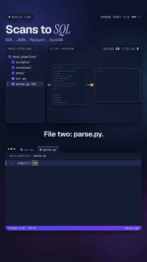

# Build Lab 02 · Documents to data

   



**Scans in. SQL out. Then search them by meaning.** Ten scanned invoices are only pictures until you read them.
Part 1 runs OCR on every image, parses the text into fields, writes a typed Parquet table and asks DuckDB for spend
by vendor: 40 of 40 fields found, Northwind Office Supply leads with $1,449.00. Part 2 embeds the same text into
LanceDB and answers "Which invoices were for caffeine?" with the two Harbor Coffee invoices (scores 0.75 and 0.73),
even though the word caffeine appears in neither.

Watch: [YouTube](https://www.youtube.com/@datanatomyai) · [TikTok](https://www.tiktok.com/@datanatomy.ai) · [Instagram](https://www.instagram.com/datanatomy.ai) (Part 1: 140 seconds · Part 2: 143 seconds)

<br clear="right">

## The idea

One folder of documents, two consumers of the same data:

1. **OCR** turns pixels into characters. A scan has no letters in it, only brightness values.
2. **Parse** turns raw text into a schema: the same named fields (vendor, invoice number, date, total) for every invoice.
3. **Store** the records as Parquet: columnar, typed and compressed, so SQL tools can query the file directly.
4. **Query** with DuckDB for analytics (Part 1).
5. **Embed** each invoice's text as a vector of 384 numbers that captures its meaning, and store it in a vector database (Part 2).
6. **Retrieve** the nearest invoices to a question and put their text, tagged with invoice numbers, into a prompt for a language model. That last step is RAG: retrieval-augmented generation.

## What you'll build

```
docs_pipeline/
├── invoices/                10 scanned invoice PNGs
├── data/                    output only (created when you run)
│   ├── docs.json            parsed records
│   ├── docs.parquet         the typed table
│   └── lancedb/             the vector database
├── scripts/
│   └── make_invoices.py     drew the invoice images
├── ocr.py                   Part 1, file 1: pixels to text
├── parse.py                 Part 1, file 2: text to fields
├── main.py                  Part 1, file 3: JSON, Parquet, DuckDB
├── embed.py                 Part 2, file 1: text to vectors
├── store.py                 Part 2, file 2: vectors into LanceDB
└── search.py                Part 2, file 3: question to prompt with sources
```

The six pipeline files sit at the top, exactly as in the videos. `invoices/` is the input, `scripts/` holds the
one-off tool that made it, and `data/` holds output only, so it's safe to delete and rebuild. Part 2 reads the
Parquet file that Part 1 writes, so run `main.py` before `search.py`.

## Install

Tesseract is a program, not a Python package, so install it with your system's package manager first:

```bash
brew install tesseract            # macOS
sudo apt install tesseract-ocr    # Debian / Ubuntu
```

On Windows, use the installer linked from the [Tesseract documentation](https://tesseract-ocr.github.io/tessdoc/Installation.html)
and make sure `tesseract` is on your PATH. Check with `tesseract --version`. The video used Tesseract 5.5.2.

Then the Python packages (Pillow 10.1 or newer, for the scalable default font in `make_invoices.py`):

```bash
pip install pillow pytesseract pandas pyarrow duckdb fastembed lancedb
```

The first time `embed.py` runs, fastembed downloads the `bge-small-en-v1.5` model (about 64 MB, an ONNX file
from Hugging Face) and caches it in your system's temp folder. After that it runs offline on the CPU. Set
`FASTEMBED_CACHE_PATH` to keep the model somewhere permanent.

## Run it

```bash
cd docs_pipeline
python3 main.py      # Part 1
python3 search.py    # Part 2
```

```
10 invoices read, 40/40 fields
Northwind Office Supply    1,449.00
Cobalt Cloud Hosting       1,168.00
Summit Freight               745.00
```

```
10 invoices embedded, 384 dims
Q: Which invoices were for caffeine?
INV-2043 Harbor Coffee Roasters 0.75
INV-2049 Harbor Coffee Roasters 0.73
prompt: 438 chars, sources [INV-2043] [INV-2049]
```

On a fresh `data/` folder, LanceDB also prints a line like
`WARN lance::dataset::write::insert] No existing dataset at .../invoices.lance, it will be created`. It goes to
stderr and is harmless: it only says the table is new. Each part takes a few seconds once the model is cached.

The invoice images are included. To redraw them, run `python3 scripts/make_invoices.py` from `docs_pipeline/`.
It uses a fixed seed, so the files come out identical.

## About the invoices

`scripts/make_invoices.py` draws ten invoices from six vendors with Pillow: vendor name, invoice number, date, two
line items and a total. A slight tilt, blur and paper noise make them look scanned, so OCR has real work to do.
It is not perfect: on `INV-2048` Tesseract reads "invoice No:" with a small i, which is why the patterns in
`parse.py` ignore case.

## Part 1, file 1: `ocr.py`

| Line | Code | What it does |
|------|------|--------------|
| 1 to 4 | imports | `Path` for files, `pytesseract` to call the Tesseract program, Pillow's `Image` to open PNGs. |
| 7 | `def ocr_folder(folder):` | Read every image in a folder. |
| 8 | `texts = {}` | Results, keyed by file name. |
| 9 | `for png in sorted(Path(folder).glob("*.png")):` | Every PNG, in a fixed order. |
| 10 | `img = Image.open(png).convert("L")` | Open it and convert to grayscale (`"L"` is one brightness channel). |
| 11 to 12 | `pytesseract.image_to_string(img)` | Tesseract finds the lines of text and recognizes them, returning plain characters. |
| 13 to 14 | `texts[png.name] = text`, `return texts` | Keep each file's text under its name. |

## Part 1, file 2: `parse.py`

| Line | Code | What it does |
|------|------|--------------|
| 1 | `import re` | Regular expressions. |
| 3 to 7 | `FIELDS = {...}` | The schema: one pattern per field. Invoice number is `INV-` and digits, the date is year-month-day, the total is the dollar amount after `TOTAL`. The part in parentheses is what gets kept. |
| 10 | `def parse(text):` | One invoice's raw text in, one record out. |
| 11 to 12 | `lines = ...` | Strip each line and drop the blank ones. |
| 13 | `rec = {"vendor": lines[0]}` | The vendor is the first line of the invoice. |
| 14 to 16 | `re.search(pattern, text, re.I)` | Search for each field, ignoring case. A field that isn't found becomes `None` instead of crashing. |
| 17 to 19 | `float(amount)` | The total becomes a real number (`"1,168.00"` to `1168.0`). |
| 20 to 21 | `rec["text"] = ...`, `return rec` | Keep the full text as one line. Part 2 embeds it. |

## Part 1, file 3: `main.py`

| Line | Code | What it does |
|------|------|--------------|
| 1 to 5 | imports | JSON, DuckDB, pandas, and our two steps. |
| 7 to 8 | `texts = ...`, `records = ...` | OCR every scan, parse every text. |
| 9 to 10 | `json.dump(records, ...)` | Save the records as JSON, one object per invoice. |
| 12 | `df = pd.DataFrame(records)` | One row per invoice, one column per field. |
| 13 | `pd.to_datetime(df["date"])` | Dates as text become a real date type. |
| 14 | `df.to_parquet(...)` | Write the typed table as Parquet. |
| 15 to 17 | `ok = ...`, `print(...)` | Count the fields that were found: 4 fields × 10 invoices = 40. |
| 18 to 22 | `sql = ...`, `duckdb.sql(sql)` | SQL straight on the Parquet file: total spend by vendor, top three. No database server. |

## Part 2, file 1: `embed.py`

| Line | Code | What it does |
|------|------|--------------|
| 1 | `from fastembed import TextEmbedding` | A small library that runs embedding models on the CPU with ONNX Runtime. |
| 3 to 4 | `model = TextEmbedding("BAAI/bge-small-en-v1.5")` | Load an open model once, when the module is imported. No API key. |
| 7 to 9 | `def embed(texts):` | Each text becomes 384 numbers. Texts with similar meaning get vectors that point in similar directions. |

## Part 2, file 2: `store.py`

| Line | Code | What it does |
|------|------|--------------|
| 1 to 3 | imports | LanceDB, pandas, and our `embed`. |
| 6 | `def build_index():` | Build the vector table from Part 1's output. |
| 7 | `pd.read_parquet("data/docs.parquet")` | The same table DuckDB queried. |
| 8 | `df["vector"] = embed(...)` | Add a vector column: one embedding per invoice text. |
| 9 to 11 | `lancedb.connect(...)`, `create_table(...)` | Save vectors and metadata side by side in a local folder. `mode="overwrite"` rebuilds it on every run. |

## Part 2, file 3: `search.py`

| Line | Code | What it does |
|------|------|--------------|
| 1 to 5 | imports, `build_index()` | Build the index and report its size. |
| 7 to 8 | `q = ...` | The question. None of the invoices contains the word "caffeine". |
| 9 to 10 | `table.search(embed([q])[0])` | Embed the question with the same model, then find the 2 nearest invoices by cosine distance. |
| 11 to 13 | `score = round(1 - h["_distance"], 2)` | Cosine distance is 1 minus cosine similarity, so 1 minus the distance gives the similarity back. Closer to 1 means closer in meaning. |
| 15 to 19 | `ctx = ...`, `prompt = ...` | Put the retrieved text into a prompt, each tagged with its invoice number so the answer can cite it. |
| 20 | `# in production, ...` | No model is called here. In a real app this prompt goes to an LLM. |
| 21 to 22 | `ids = ...`, `print(...)` | Print the prompt size and its sources. |

## Same data, two consumers

The Parquet file is the hand-off point. DuckDB, pandas, Spark and most warehouses read it for SQL analytics,
and the same `text` column feeds the embedding model for AI retrieval. Neither consumer needs to know about OCR.

## What the video simplified

- **Clean scans.** These invoices share one layout and one font, so a few regular expressions find every field.
  Real documents vary, and production pipelines add layout-aware extraction or a model for fields, plus checks
  that flag records with missing values (`None` here) for a person to review.
- **One chunk per invoice.** Each invoice is short, so its whole text is one vector. Long documents are split into
  chunks first, and each chunk gets its own vector and citation.
- **Exact search.** With ten rows, LanceDB compares the question against every vector. At millions of rows,
  vector databases build an approximate index so search stays fast.
- **Scores are relative.** Similarities from this model sit in a narrow band (unrelated invoices still score
  between 0.6 and 0.7), so rank matters more than the absolute number.
- **No model call.** The prompt is built but not sent, so the answer itself is not generated here.

## Try this

1. Add a `vendor` filter: `table.search(...).where("vendor = 'Summit Freight'")`. Which question returns a different top hit with the filter on?
2. Ask "Which invoices were for printer toner?" and then "Who did we pay to keep the office tidy?". Which one would plain keyword search also have found?
3. Add an `items` field to `FIELDS` that captures the first line item after `Description`. How many of the 10 invoices does your pattern match?
4. Change `limit(2)` to `limit(4)` and print all scores. How big is the gap between the coffee invoices and the next one?

---
Previous: [14 · Polars](../14-polars) · [All lessons](../../README.md)
