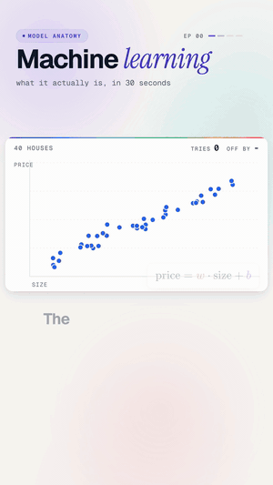

# 00 · What is machine learning

   



**Nobody told this line where to go.** It looks at 40 houses, guesses prices, measures how wrong it was, and nudges
two numbers. After 2,000 tries it has learned a rule for pricing houses, without anyone writing that rule.

Watch: [YouTube](https://www.youtube.com/@datanatomyai) · [TikTok](https://www.tiktok.com/@datanatomy.ai) · [Instagram](https://www.instagram.com/datanatomy.ai) (35 seconds)

<br clear="right">

## The idea

Normal programming: you write the rules. Machine learning: you show examples and let the program find the rule.

Here the rule is a straight line, `price = w × size + b`. The model is just two numbers, `w` (how steep the line is)
and `b` (where it starts). Training means adjusting those two numbers until the line sits close to the examples.

## Run it

```bash
python3 src/learn.py
```

```
price = 3.33 * size + 2.44
```

## Files

```
00-what-is-machine-learning/
├── data/
│   └── houses.csv        40 houses: size and price
├── scripts/
│   └── make_houses.py    made houses.csv (you don't need to run it)
└── src/
    ├── learn.py          the 8 lines from the video
    └── houses.py         loads houses.csv into x and y
```

Data and code each get their own folder, so you can swap in different data without touching the model.

`make_houses.py` made the 40 examples. The prices follow `3 × size + 4` plus some random noise, the way real data
is never perfectly on a line. It uses a fixed random seed, so running it again gives the same 40 houses.

## The code

`src/learn.py`, line by line:

| Line | Code | What it does |
|------|------|--------------|
| 1 | `import numpy as np` | NumPy lets us do math on all 40 houses at once. |
| 2 | `from houses import x, y` | `x` is the size of each house, `y` its real price. |
| 3 | `w, b = 0.0, 0.0` | The model starts clueless: a flat line at zero. |
| 4 | `for epoch in range(2000):` | Repeat the lesson 2,000 times. One pass over the data is an *epoch*. |
| 5 | `err = w * x + b - y` | Guess every price, subtract the real price. Positive means we guessed too high. |
| 6 | `w -= 0.01 * (err * x).mean()` | Nudge the slope against the error. Big houses with big errors push hardest. |
| 7 | `b -= 0.01 * err.mean()` | Nudge the starting point against the average error. |
| 8 | `print(...)` | Show the rule it learned. |

The `0.01` is the *learning rate*: how big each nudge is. Lines 5 to 7 are gradient descent, covered properly in
[lesson 01](../01-gradient-descent).

## Why the answer isn't exactly 3 and 4

The data was made from `3 × size + 4`, but the model learns `3.33 × size + 2.44`. Two reasons: the noise moves the
best-fitting line a little, and 2,000 small steps is not quite enough for `b` to settle. Try more epochs and watch
it move.

## Try this

1. Change `range(2000)` to `range(200)`. How far off is the line?
2. Use the learned rule to price a house of size 7.6 (the "house it has never seen" in the video).
3. Change the learning rate to `0.05`, then `0.1`. One of them breaks. Why?
4. Add `print(epoch, w, b)` inside the loop for the first 10 epochs and watch the numbers move.

---
Next: [01 · Gradient descent](../01-gradient-descent) · [All lessons](../../README.md)
