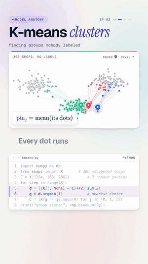

# 02 · K-means clustering

   



**300 dots. Zero labels. Find the groups.** K-means drops three pins, sends every dot to its closest pin, moves each
pin to the middle of its crowd, and repeats until nothing moves. It ends with three clean groups of 100.

Watch: [YouTube](https://www.youtube.com/@datanatomyai) · [TikTok](https://www.tiktok.com/@datanatomy.ai) · [Instagram](https://www.instagram.com/datanatomy.ai) (31 seconds)

<br clear="right">

## The idea

Most of the data in a company has no labels. Nobody tagged which customers or shops belong together. K-means is
the classic way to find groups anyway (*unsupervised* learning). It has two steps, repeated:

1. **Assign:** every point joins its nearest center.
2. **Update:** every center moves to the average of its points.

The `k` is how many groups you ask for. Here, 3.

## Run it

```bash
python3 src/kmeans.py
```

```
group sizes: 100 100 100
```

## Files

```
02-k-means/
├── data/
│   └── shops.csv         300 shop locations (x, y), no labels
├── scripts/
│   └── make_shops.py     made shops.csv
└── src/
    ├── kmeans.py         the 8 lines from the video
    └── shops.py          loads shops.csv into X
```

`make_shops.py` made 300 points in three blobs (100 each) around three hidden centers. It doesn't save which blob a
point came from, so the algorithm never sees it.

## The code

`src/kmeans.py`, line by line:

| Line | Code | What it does |
|------|------|--------------|
| 1 | `import numpy as np` | For distances and averages on all points at once. |
| 2 | `from shops import X` | 300 shops, each an (x, y) position. No labels. |
| 3 | `C = X[[234, 263, 286]]` | Three starting centers, picked from the data. |
| 4 | `for step in range(8):` | Eight rounds of assign and update. |
| 5 | `d = ((X[:, None] - C)**2).sum(2)` | Squared distance from every point to every center: a 300 × 3 table. |
| 6 | `g = d.argmin(1)` | Each point picks its closest center (0, 1 or 2). |
| 7 | `C = [X[g == j].mean(0) for j in (0, 1, 2)]` | Each center moves to the middle of its points. |
| 8 | `print(...)` | How many points ended up in each group. |

## The catch: the starting pins matter

The three starting points (234, 263, 286) all come from the same blob, which makes the video interesting: the pins
start crowded together and have to spread out. Bad starts can also get stuck in a wrong answer. Try
`C = X[[0, 1, 2]]` and see the groups come out uneven. That's why libraries use k-means++ (smarter starting points)
and run several starts.

## Try this

1. Try the starting points `X[[0, 1, 2]]`. What group sizes do you get, and why?
2. Print `C` after each step to watch the centers move.
3. Change `range(8)` to `range(2)`. Has it finished yet?
4. Ask for 4 groups instead of 3. What does k-means do with a cluster that isn't there?

---
Previous: [01 · Gradient descent](../01-gradient-descent) · Next: [03 · The AI agent loop](../../ai-engineering/03-ai-agent-loop) · [All lessons](../../README.md)
