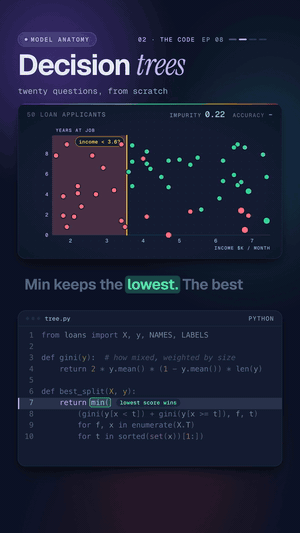

# 08 · Decision trees

   



**This model plays twenty questions with your data, and you can read every answer.** A bank has 50 past loan
applicants: monthly income, years at the current job, and whether the loan was approved. The tree tries every
possible question, keeps the one that best separates approved from declined, and asks again inside each group. It
ends up with two questions (`income < 3.6?`, then `years < 2.5?`) that get 48 of the 50 decisions right (96%).

Watch: [YouTube](https://www.youtube.com/@datanatomyai) · [TikTok](https://www.tiktok.com/@datanatomy.ai) · [Instagram](https://www.instagram.com/datanatomy.ai) (137 seconds)

<br clear="right">

## The idea

A decision tree is a stack of yes/no questions. Each question splits a group of people in two, and the goal is
groups that are "clean": all approved, or all declined.

1. **Score how mixed a group is.** This is the *Gini impurity*: `2 × p × (1 − p)`, where `p` is the share
   approved. It is 0 when everyone got the same decision and 0.5 at a fifty-fifty mix.
2. **Try every question.** For each feature (income, years) and each value it takes, split the group into
   "below" and "at or above", and add up the impurity of both sides, each weighted by its size.
3. **Keep the lowest score.** That is the best question for this group.
4. **Repeat inside each side** until a group is pure or the tree is two questions deep. Each final group (a *leaf*)
   predicts its majority decision.

Here the mix starts at 0.50. The first question (`income < 3.6?`) brings it to 0.22, the second (`years < 2.5?`)
to 0.07.

## Run it

```bash
python3 src/tree.py
```

```
income < 3.6? yes: declined
income < 3.6? no: years < 2.5? yes: declined
income < 3.6? no: years < 2.5? no: approved
accuracy: 96%
```

Each line is one leaf, written as the path of questions that leads to it. To rebuild the data file (it comes out
the same every time):

```bash
python3 scripts/make_applicants.py
```

```
wrote 50 applicants to applicants.csv
```

## Files

```
08-decision-trees/
├── data/
│   └── applicants.csv        50 applicants: income ($1000s/month), years at job, approved (1) or not (0)
├── scripts/
│   └── make_applicants.py    made applicants.csv (seeded)
└── src/
    ├── tree.py               the 22 lines from the video
    └── loans.py              loads applicants.csv into X, y and names the features and labels
```

The data is generated, not real bank records. `make_applicants.py` makes approval likely for steady income and a
stable job, then rolls a die for every applicant, so a few decisions don't follow the obvious rule. Those are the
two applicants the tree gets wrong. `loans.py` finds the CSV from its own location, so `tree.py` runs from any
folder.

## The code

`src/tree.py`, line by line:

| Line | Code | What it does |
|------|------|--------------|
| 1 | `from loans import X, y, NAMES, LABELS` | `X` is a 50 × 2 array (income, years), `y` holds 0 or 1 per applicant. `NAMES` and `LABELS` are only used for printing. |
| 3 to 4 | `def gini(y): ... return 2 * y.mean() * (1 - y.mean()) * len(y)` | `y.mean()` is the share approved, `1 - y.mean()` the share declined. Times the group size, so a big mixed group counts more than a small one. |
| 6 to 7 | `def best_split(X, y): return min(` | Scores every candidate question and returns the cheapest as `(score, feature, threshold)`. `min` compares the score first. |
| 8 | `(gini(y[x < t]) + gini(y[x >= t]), f, t)` | One candidate: split on "is `x` below `t`?" and add the impurity of both sides. |
| 9 | `for f, x in enumerate(X.T)` | Every feature. `X.T` turns the columns into rows, so `x` is one whole column. |
| 10 | `for t in sorted(set(x))[1:])` | Every distinct value as a threshold. The smallest is skipped: nothing is below it, so it can't split anything. |
| 12 | `def grow(X, y, say="", d=0):` | Builds the tree recursively. `say` is the path of questions so far, `d` the depth. |
| 13 | `vote = round(y.mean())` | The majority decision of this group: 1 if more than half were approved. |
| 14 to 16 | `if d == 2 or gini(y) == 0: ...` | Stop at two questions deep or when the group is pure. Print the path and the answer, and return how many of this group the answer gets right. |
| 17 | `_, f, t = best_split(X, y)` | Otherwise, find the best question for this group. |
| 18 | `q, m = f"...", X[:, f] < t` | `q` is the question as text, `m` marks who answers yes. |
| 19 to 20 | `return (grow(X[m], ...) + grow(X[~m], ...))` | Grow both sides one level deeper and add up their correct answers. `~m` means "answered no". |
| 22 | `print(f"accuracy: {grow(X, y) / len(y):.0%}")` | Grow from the full group and print correct answers out of 50. |

## Why the weights matter

The size weighting in `gini` is not a detail. Without it, a split that peels off a few people into a perfectly
pure group looks great even if it leaves a big messy group behind. Remove `* len(y)` from line 4 and the tree
picks `years < 1.4?` for its second question instead of `years < 2.5?`, and accuracy drops from 96% to 90%. Real
libraries do the same weighting; they divide by the total count, which doesn't change which split wins.

## What the video simplified

- **Training accuracy is not the real test.** The 96% is measured on the same 50 applicants the tree learned from.
  A deeper tree would score higher here and do worse on new people (see Try this, question 1). In practice you
  hold some data back and measure on that.
- **Thresholds are data values.** The rule reads `income < 3.6`, the value of the first applicant on the right side.
  Libraries usually put the threshold halfway between two neighboring values (3.55 here), which reads the same.
- **Readable is the point.** A declined applicant can be told the exact reason: under 2.5 years at the job. In
  lending, explaining a denial is often a legal requirement, which is one reason simple trees and rule lists are
  still used there.
- **Trees are building blocks.** Random forests average many trees trained on random samples of the data. Gradient
  boosting adds trees one by one, each fixing the errors of the ones before. Both are go-to models for tabular
  data, and both start from exactly this split search.

## Try this

1. Change `d == 2` to `d == 3` on line 14. One new rule splits off a single applicant (`income < 7.4?`). Accuracy
   goes up to 98%. Is that rule something you'd trust for the next applicant?
2. Change it to `d == 1`. How much accuracy does the second question add?
3. Write a `predict(x)` that walks the two questions for one applicant. What does it say for income 5.1 and 1
   year at the job, the applicant from the video?
4. Remove `* len(y)` from line 4 and run again. Which second question does the tree pick now, and why does a small
   pure group win?

---
Previous: [07 · Linear regression, no libraries](../07-linear-regression-no-libraries) · Next: [09 · A neural network from scratch](../09-neural-network-from-scratch) · [All lessons](../../README.md)
