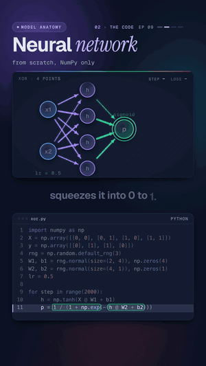

# 09 · A neural network from scratch

   



**One straight line can't solve this four-point puzzle. Two layers can.** The puzzle is XOR: output 1 when exactly
one of two inputs is 1. A network with 2 inputs, 4 hidden neurons and 1 output learns it in 2,000 steps, with the
forward pass, the loss and backpropagation all written out by hand in NumPy. The loss falls from 0.795 to 0.001 and
the predictions come out `0 1 1 0`.

Watch: [YouTube](https://www.youtube.com/@datanatomyai) · [TikTok](https://www.tiktok.com/@datanatomy.ai) · [Instagram](https://www.instagram.com/datanatomy.ai) (145 seconds)

<br clear="right">

## The idea

XOR has four points: (0,0) gives 0, (0,1) gives 1, (1,0) gives 1, (1,1) gives 0. Put them on a grid and try to
separate the 1s from the 0s with one straight line. You can't: any line gets at most 3 of the 4 right. In 1969,
Minsky and Papert showed that a single-layer perceptron can't learn XOR, and interest in neural networks cooled for
years.

The fix is a hidden layer with a non-linearity (a bend) in it. Each hidden neuron draws its own straight line; the
output neuron combines them into a shape no single line can make, here a band through the two 1s.

Training is the same loop as lessons 01 and 07, with one more layer to push the blame through:

1. **Forward:** inputs → hidden neurons (`tanh`) → output (`sigmoid`), a guess between 0 and 1.
2. **Loss:** how far each guess is from the answer, squared.
3. **Backward:** the chain rule, layer by layer, gives every weight its share of the blame.
4. **Step:** every weight moves a little downhill. Repeat 2,000 times.

## Run it

```bash
python3 src/xor.py
```

```
step    0: loss 0.795
step 1999: loss 0.001
predictions: 0 1 1 0
```

It needs NumPy (`pip install -r requirements.txt` from the repo root). The output is the same on every run because
the random weights come from a fixed seed.

## Files

```
09-neural-network-from-scratch/
└── src/
    └── xor.py            the 22 lines from the video
```

The four XOR points are written straight into the code, like lesson 07: there is no data to load, so everything the
network learns from is on screen.

## The code

`src/xor.py`, line by line:

| Line | Code | What it does |
|------|------|--------------|
| 1 | `import numpy as np` | Matrix math on all four inputs at once. |
| 2 | `X = np.array([[0, 0], [0, 1], [1, 0], [1, 1]])` | The four inputs, one per row: a 4 × 2 matrix. |
| 3 | `y = np.array([[0], [1], [1], [0]])` | The answers XOR wants, as a 4 × 1 column. |
| 4 | `rng = np.random.default_rng(3)` | A seeded random generator, so every run starts from the same weights. |
| 5 | `W1, b1 = rng.normal(size=(2, 4)), np.zeros(4)` | Random weights from 2 inputs to 4 hidden neurons, biases at zero. |
| 6 | `W2, b2 = rng.normal(size=(4, 1)), np.zeros(1)` | Random weights from 4 hidden neurons to 1 output. |
| 7 | `lr = 0.5` | Learning rate: the size of each step. |
| 9 | `for step in range(2000):` | 2,000 rounds of forward, backward, step. |
| 10 | `h = np.tanh(X @ W1 + b1)` | Forward, hidden layer: each neuron mixes the inputs, then `tanh` bends the result into -1 to 1. |
| 11 | `p = 1 / (1 + np.exp(-(h @ W2 + b2)))` | Forward, output: mix the hidden values, then the sigmoid squeezes the result to between 0 and 1. |
| 12 | `loss = np.sum((p - y) ** 2) / 2` | Half the sum of squared errors over the four points. |
| 13 to 14 | `if step in (0, 1999): print(...)` | Print the loss at the first and last step. |
| 15 | `dz2 = (p - y) * p * (1 - p)` | Backward, output: the error times the sigmoid's slope, `p * (1 - p)`. |
| 16 | `dz1 = dz2 @ W2.T * (1 - h ** 2)` | Backward, hidden: send the output's blame back through `W2`, times the slope of `tanh`, `1 - h²`. |
| 17 to 18 | `W2 -= lr * h.T @ dz2`, `b2 -= ...` | Step the output layer's weights and bias downhill. |
| 19 to 20 | `W1 -= lr * X.T @ dz1`, `b1 -= ...` | Step the hidden layer's weights and biases downhill. |
| 22 | `print("predictions:", ...)` | Round each output to 0 or 1 and print all four. |

The `/ 2` in the loss is there so the gradient on line 15 comes out exact, with no stray factor of 2. The gradients
are summed over the four points, not averaged. `p` and `loss` on lines 11 to 12 are computed before the last update,
so the printed predictions come from step 1999.

## The catch: where you start matters

Change the seed on line 4 to `default_rng(0)` and the same code gets stuck:

```
step    0: loss 0.559
step 1999: loss 0.252
predictions: 0 0 1 1
```

Two points are wrong. The raw outputs for (0,1) and (1,1) are 0.499 and 0.501: the network sits on the fence for
them and stops improving. Running 20,000 steps instead of 2,000 still ends at a loss of 0.250. Gradient descent only
ever walks downhill from where it started, and from this start it settles somewhere that isn't a solution.

This is not common for this setup: of seeds 0 to 19, only seed 0 fails. Two things that help in practice are more
hidden neurons (with 8 instead of 4, seed 0 solves XOR) and starting weights scaled to the layer size, which is what
libraries like PyTorch do by default. The video picked seed 3 because it works and its loss stalls briefly before
the boundary bends, which is nice to watch.

## What the video simplified

Every deep network, including large language models, uses this same recipe: layers, a non-linearity, a loss,
backpropagation, gradient descent. The real thing differs in scale and in details. Frameworks compute the backward
pass for you (automatic differentiation) instead of writing `dz1` and `dz2` by hand. Classifiers usually use
cross-entropy loss instead of squared error. Training uses mini-batches of data and optimizers like Adam instead of
plain full-batch steps. None of that changes the chain rule underneath.

## Try this

1. Set the seed to 0 and print `p.round(3)` at the end. Which points is the network unsure about?
2. Change the hidden layer from 4 neurons to 2 (lines 5 and 6). Two lines are enough to carve XOR in theory. Does
   seed 3 still find them?
3. Set `lr = 0.05`. How far does the loss get in 2,000 steps, and are the predictions still right?
4. Delete `np.tanh` on line 10 (keep `X @ W1 + b1`) and fix line 16 so the slope is 1. Why can't the network solve
   XOR any more, no matter how long it trains?

---
Previous: [08 · Decision trees](../08-decision-trees) · Next: [10 · Overfitting](../10-overfitting) · [All lessons](../../README.md)
