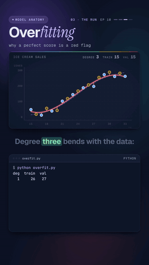

# 10 · Overfitting

   



**A perfect score on the training data is a red flag.** Nineteen days of ice cream sales: ten days to learn from,
nine held back. Curves of degree 1, 3, 5, 7 and 9 are fitted to the ten training days. Degree 9 passes through
every training point (error 0) but misses the unseen days by 69 cones. Degree 3 misses by 15 on both, and wins.

Watch: [YouTube](https://www.youtube.com/@datanatomyai) · [TikTok](https://www.tiktok.com/@datanatomy.ai) · [Instagram](https://www.instagram.com/datanatomy.ai) (142 seconds)

<br clear="right">

## The idea

A model that memorizes its training data can score perfectly on it and still be useless on new data. That is
*overfitting*. The only way to see it is to score the model on data it never trained on.

1. **Split:** keep some data aside (the *validation set*). The model never sees it while fitting.
2. **Fit:** train models of growing flexibility on the training set only.
3. **Score twice:** measure the error on the training set and on the validation set.
4. **Pick:** choose the model with the lowest validation error, not the lowest training error.

Training error keeps falling as the model gets more flexible. Validation error falls, then rises. Too simple is
*underfitting*, too flexible is *overfitting*; the bottom of the validation curve is the sweet spot.

## Run it

```bash
python3 src/overfit.py
```

```
deg  train  val
  1     26   27
  3     15   15
  5     11   19
  7      8   24
  9      0   69
best degree: 3
```

The errors are in cones: the typical miss on one day.

## Files

```
10-overfitting/
└── src/
    └── overfit.py      the 22 lines from the video
```

There is no data folder: the script makes its own data from a seeded random generator, so every run prints the same
numbers. The data is a smooth S-shaped trend (sales climb with temperature, then level off) plus random noise, which
is what real measurements look like: a pattern you want to learn and noise you don't.

## The code

`src/overfit.py`, line by line:

| Line | Code | What it does |
|------|------|--------------|
| 1 | `import numpy as np` | Arrays, random numbers and polynomial fitting. |
| 3 | `rng = np.random.default_rng(149)` | A random generator with a fixed seed, so the noise is the same on every run. |
| 4 | `temp = np.arange(15, 34)` | One day per temperature, 15 to 33 °C (the end, 34, is excluded): 19 days. |
| 5 | `trend = 300 / (1 + np.exp((24 - temp) / 3))` | The true pattern: an S-curve that rises around 24 °C and levels off near 300 cones. |
| 6 | `cones = trend + rng.normal(0, 20, temp.size)` | What was actually sold: the trend plus noise with a spread of 20 cones. |
| 7 | `train = temp % 2 == 1` | Odd temperatures (15, 17, ..., 33) are the training set: 10 days, as a True/False mask. |
| 8 | `val = ~train` | The other 9 days are the validation set. `~` flips the mask. |
| 10 to 12 | `def rmse(p, days): ...` | Scores a fitted curve `p` on some days: predict with `np.polyval`, take each miss, square, average, square root. The result is the root mean squared error, a typical miss in cones. |
| 14 | `scores = []` | Collects `(validation error, degree)` pairs. |
| 15 | `print("deg  train  val")` | The table header. |
| 16 | `for deg in range(1, 10, 2):` | Degrees 1, 3, 5, 7, 9: from a straight line to a very bendy curve. |
| 17 | `p = np.polyfit(temp[train], cones[train], deg)` | The least-squares polynomial of that degree, fitted on the training days only. `p` is its list of coefficients. |
| 18 | `tr, va = rmse(p, train), rmse(p, val)` | Score the same curve twice: on the days it learned from and on the days it never saw. |
| 19 | `scores.append((va, deg))` | Keep the validation score. Putting it first makes the pairs sort by error. |
| 20 | `print(f"{deg:3} {tr:6.0f} {va:4.0f}")` | One row of the table, rounded to whole cones. |
| 22 | `print("best degree:", min(scores)[1])` | `min` finds the pair with the lowest validation error; `[1]` takes its degree. |

## Why degree 9 scores zero

Ten training points and a degree-9 polynomial: a degree-9 polynomial has 10 coefficients, so it can pass exactly
through any 10 points with different x values. The training error is zero by construction, not because the model
learned anything. To hit every noisy point, the curve has to swing between them. At 32 °C, a day it never saw, it
predicts about 110 cones; that day sold 281.

This is why a perfect training score is suspicious in practice. A model with enough parameters can memorize its
training set, noise included. In production a model only ever sees new data, so the score that counts is the one on
data it was not trained on.

## What the video simplified

- **One split.** The odd/even split is a single, tidy split. With so few days the numbers depend on which days land
  where (see exercise 4). *Cross-validation* repeats the split several ways and averages the scores, which is more
  reliable.
- **Picking on validation leaks a little.** Choosing the degree by validation error means the validation score of
  the winner is slightly optimistic. Real projects keep a third set, the *test set*, untouched until the very end.
- **Regularization was shown, not run.** The video shows the degree-9 curve calming down to illustrate
  regularization. Real regularization (for example ridge regression) keeps the flexible model but adds a penalty
  for large coefficients, which smooths the curve. This file only changes the degree.
- **Fake data.** We know the true trend here because we made it. With real data you never see it; the validation
  error is how you estimate how close you are.

## Try this

1. Change `range(1, 10, 2)` to `range(1, 10)` to try every degree from 1 to 9. Is the U shape still there, and does
   the best degree change?
2. Change the noise in line 6 from `20` to `5`. What happens to the gap between degree 3 and degree 9, and why?
3. Change the seed in line 3 to `7`. Does degree 3 still win? Try a few seeds.
4. Swap the sets: `train = temp % 2 == 0` (9 training days). Why does the validation error for degrees 7 and 9 get so
   much worse? Hint: which days are now at the edges of the range?

---
Previous: [09 · A neural network from scratch](../09-neural-network-from-scratch) · Next: [11 · Choosing a model](../11-choosing-a-model) · [All lessons](../../README.md)
