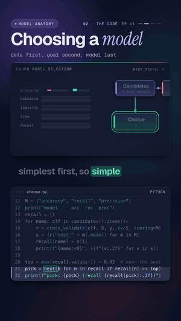

# 11 · Choosing a model

   



**There is no best algorithm. Here's how teams actually pick one.** A subscription company wants to predict which
of its 3,000 customers will churn. We look at the data first, choose the metric the business cares about (recall),
build a baseline, and compare three models fairly with 5-fold cross-validation. The baseline has the best accuracy
(0.80) and catches zero churners. Logistic regression catches 76% and is also the simplest model, so it wins.

Watch: [YouTube](https://www.youtube.com/@datanatomyai) · [TikTok](https://www.tiktok.com/@datanatomy.ai) · [Instagram](https://www.instagram.com/datanatomy.ai) (143 seconds)

<br clear="right">

## The idea

You don't pick a model from a leaderboard or from hype. You pick it from your data and your goal:

1. **Know your data** (exploratory data analysis, or EDA): how many rows and columns, which types, what is
   missing, how balanced the label is. Here: 3,000 rows, 150 missing values, 20% churn.
2. **Set the goal.** Missing a churner loses a customer, so we score **recall**: of everyone who really left, how
   many did we flag? **Precision** tells us how many flags were false alarms. Accuracy stays in the table as a
   warning.
3. **List the constraints.** The retention team must see why a customer is flagged, and scoring runs once a night
   on a few thousand rows. No deep nets needed.
4. **Build a baseline.** The dumbest model that could work: always say "no churn". Every real model must beat it.
5. **Compare a few candidates fairly.** Same data, same preprocessing, same five folds.
6. **Pick the simplest model that meets the goal.** If two are close, the simpler one is easier to explain, run
   and maintain.

## Run it

You need pandas and scikit-learn (`pip install pandas scikit-learn`). From this folder:

```bash
python3 src/choose.py
```

```
rows, cols: (3000, 5) missing: 150
churn rate: 20%
model     acc  rec  prec
baseline  0.80 0.00 0.00
logistic  0.73 0.76 0.40
tree      0.72 0.69 0.38
forest    0.75 0.65 0.42
pick: logistic (recall 0.76)
```

It takes a few seconds: the random forest trains five times. To rebuild the data file, run
`python3 scripts/make_customers.py` (it writes the same file every time).

## Files

```
11-choosing-a-model/
├── data/
│   └── customers.csv         3,000 customers: tenure, monthly_charges, support_tickets, contract, churn
├── scripts/
│   └── make_customers.py     made customers.csv (seeded, so it is the same every run)
└── src/
    ├── choose.py             the 22 lines from the video
    ├── customers.py          loads customers.csv into a pandas table
    └── models.py             the four candidates, each behind the same preprocessing
```

The data is made up but shaped like a real churn export: churn risk goes up with monthly contracts, higher
charges, more support tickets and short tenure, and new customers on expensive plans churn a little extra. About
3% of `monthly_charges` and 2% of `tenure` are blank on purpose, because real exports have gaps. The models live in
their own file so `choose.py` stays about the decision, not the plumbing.

## The code

`src/choose.py`, line by line:

| Line | Code | What it does |
|------|------|--------------|
| 1 | `from sklearn.model_selection import cross_validate` | Trains and scores a model on several train/test splits. |
| 2 to 3 | `from customers import ...` / `from models import ...` | The data loader and the candidate models. |
| 5 | `df = load_customers()` | The customer table: 3,000 rows. |
| 6 to 7 | `print("rows, cols:", df.shape, "missing:", ...)` | EDA step one: the size of the table and how many cells are empty. |
| 8 | `print(f"churn rate: {df.churn.mean():.0%}")` | EDA step two: the class balance. The label is 0 or 1, so its mean is the share of churners. |
| 10 | `X, y = df.drop(columns="churn"), df.churn` | Features in `X`, the label in `y`. |
| 11 | `M = ["accuracy", "recall", "precision"]` | The metrics. Recall is the goal, precision counts false alarms, accuracy is there to show why it misleads. |
| 12 to 13 | `print("model ...")` / `recall = {}` | A header for the score table, and a place to keep each model's recall. |
| 14 | `for name, clf in candidates().items():` | Every candidate, simplest first. |
| 15 | `r = cross_validate(clf, X, y, cv=5, scoring=M)` | Five folds: train on four fifths, score on the last fifth, five times. Every model gets the same folds. |
| 16 | `s = [r["test_" + m].mean() for m in M]` | Average each metric over the five test folds. |
| 17 | `recall[name] = s[1]` | Keep the recall for the decision. |
| 18 | `print(f"{name:<9}", ...)` | One row of the score table. |
| 20 | `top = max(recall.values()) - 0.02` | The bar: anything within 0.02 of the best recall counts as "as good". |
| 21 | `pick = next(n for n in recall if recall[n] >= top)` | The first model that clears the bar. The list runs simplest first, so simple wins ties. |
| 22 | `print(f"pick: {pick} ...")` | The decision. |

`models.py` builds one preprocessing pipeline and puts each model behind it: missing numbers are filled with the
median, numbers are scaled, and the contract type is one-hot encoded. The candidates are a `DummyClassifier` that
always predicts the most common class (no churn), `LogisticRegression`, a `DecisionTreeClassifier` with
`max_depth=4`, and a `RandomForestClassifier` with 300 trees. Because the preprocessing sits inside the pipeline,
`cross_validate` fits the imputer and scaler on the training folds only, so nothing leaks from the test fold.

## Why `class_weight="balanced"`

The video doesn't say it, but every real model in `models.py` is built with `class_weight="balanced"`. Only 1 in 5
customers churns, so a model trained without weights learns that "no churn" is almost always right and flags
few people. Its recall stays low even when it has learned something useful. Without the weights, logistic
regression's recall on this data drops from 0.76 to 0.33.

`"balanced"` makes each class count equally during training: every churner gets about four times the weight of a
customer who stayed (because there are about four stayers for each churner). The models then flag more people,
which raises recall and lowers precision. That is the trade the goal asks for: a missed churner costs more than a
false alarm.

We give all three models the same setting, so the comparison stays fair. The baseline doesn't train, so weights
don't change it.

## The accuracy trap

The baseline scores 0.80 accuracy, the best in the table, and catches nobody. When 80% of customers stay, saying
"stays" for everyone is right 80% of the time. On imbalanced data, always compare against this baseline and score
on the metric that matches the goal. The forest also shows the trap in a softer form: it has the best accuracy of
the real models (0.75) and the lowest recall (0.65).

## What the video simplified

- **EDA was three prints.** Real exploratory data analysis goes further: column types (`df.dtypes`), missing values
  per column (`df.isna().sum()`), distributions, outliers, and columns that leak the answer (a "cancelled_on"
  date would predict churn perfectly). Know your data before you choose anything.
- **Constraints were spoken, not coded.** Explainability, latency, budget and retraining needs decide which models
  make the shortlist before any code runs.
- **The threshold is fixed at 0.5.** Every model turns its probability into a yes or no at 0.5. Moving that
  threshold trades recall for precision. A precision of 0.40 means 6 of every 10 flags are false alarms, which may
  or may not be fine depending on what a retention call costs.
- **No tuning.** Tree depth, forest size and regularization were set once. A tuned forest might close the gap, and
  it would still be harder to explain.
- **When the data shifts, compare again.** The best model for this year's customers may not be the best next year.

## Try this

1. In `models.py`, remove `class_weight=w` from all three models. What happens to recall and precision, and which
   model wins now?
2. Change the pick rule to use accuracy instead of recall. Which model does it choose, and would the retention team
   be happy with it?
3. Add `df.isna().sum()` and `df.dtypes` after line 5. Which columns have the gaps, and which column needs one-hot
   encoding?
4. Add a fifth candidate to `models.py`, for example `GradientBoostingClassifier` (it has no `class_weight`, so
   pass `sample_weight` or leave it unweighted). Does it beat logistic regression on recall by more than 0.02?

---
Previous: [10 · Overfitting](../10-overfitting) · Next: [12 · ETL vs ELT](../../data-engineering/12-etl-vs-elt) · [All lessons](../../README.md)
